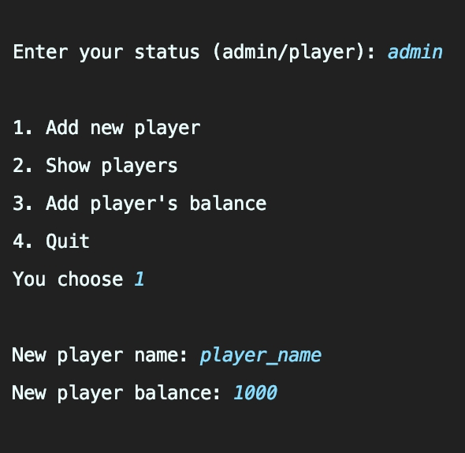
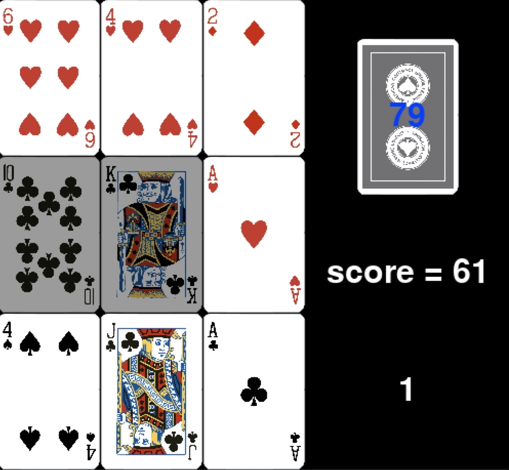
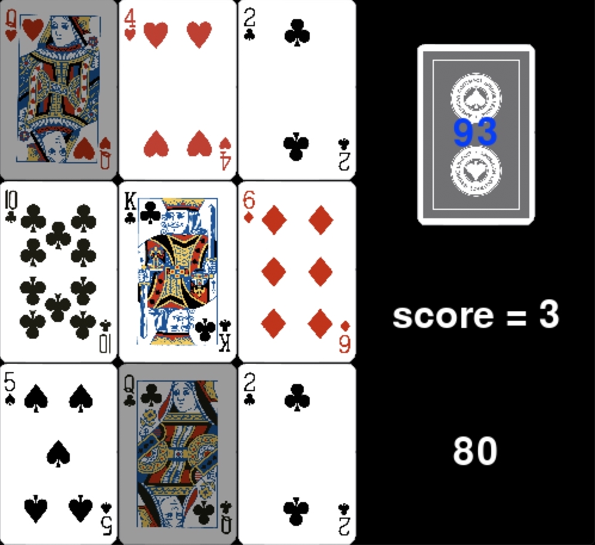
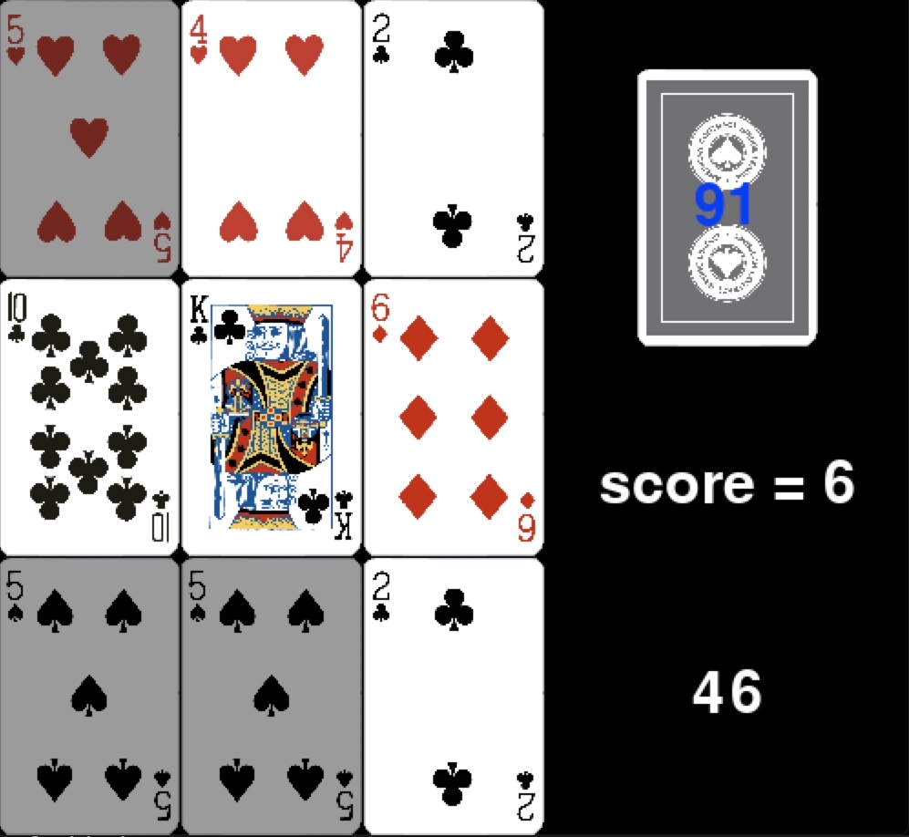
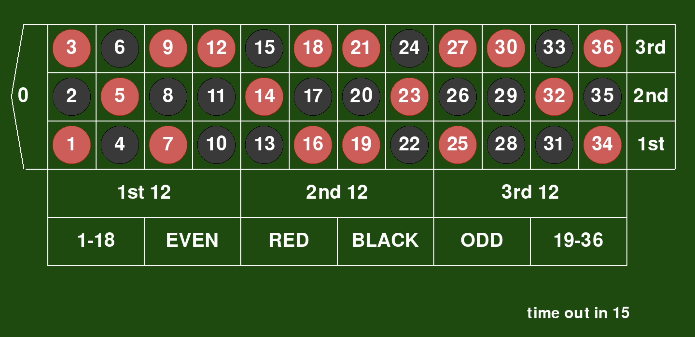
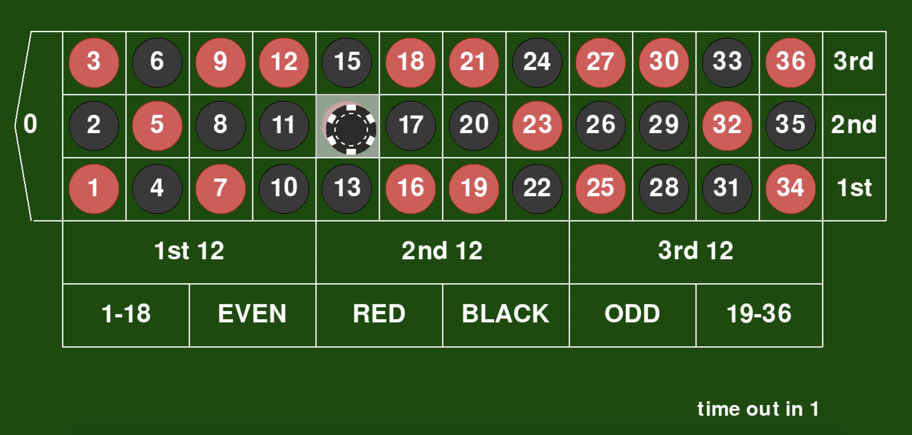
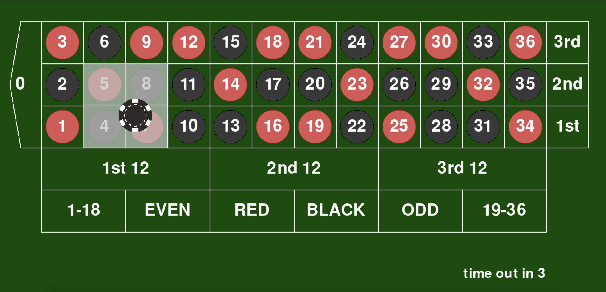
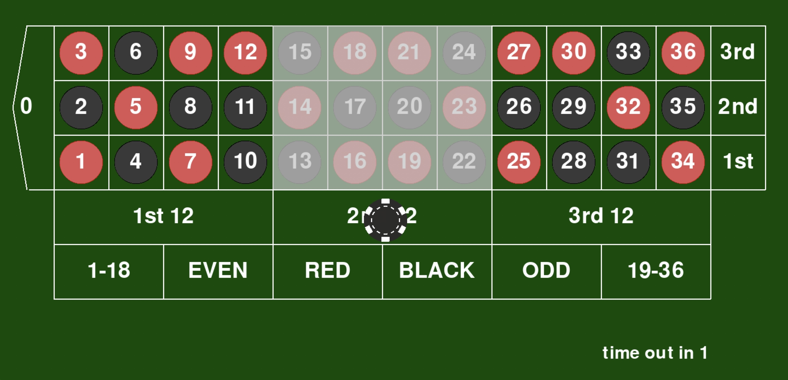

# Final Project
Final Project for SKE17's ComPro class -2019 18th Dec

---
## Table of Contents

1. [Description](#Description)
2. [Getting Started](#Getting-Started)
3. [Setting to Play](#Setting-to-Play)
4. [How to Calculate Balance](#How-to-Calculate-Balance)
4. [BLACKJACK RULES](#BLACKJACK-RULES)
5. [PAIRS RULES](#PAIRS-RULES)
6. [ROULETTE RULES](#ROULETTE-RULES)
7. [Contact](#Contact)

## Description

This program has totally of 3 games. Those are `Blackjack`, `Pairs`, and `Roulette`. 

- This program has built using `Python3.7.0`

- use to run on Python Console ONLY!!!

- This program going to import `pygame` if you didn't install it yet, then go follow <a href="https://www.pygame.org/wiki/GettingStarted">Pygame Installation</a> to install pygame first

## Getting Started

Copy code from `project_6210545505.zip`, unzip the file, enter the "project_6210545505" directory, and run the <a href="main.py">main.py</a> file in that directory.

## Setting to Play

Before playing player need to have they owe ID, so I recommend you to create you ID first as an admin. Go follow:

to create ID you need to have a player name and balance.

## How to Calculate Balance

Balance that you have at first can earn more or less after play the games. As you should know this program has 3 games, that they have a completely different way to calculate the balance after play each game. Which is follow:

- Blackjeck
    - win -> 50 points
    - tie -> 25 points
    - loose -> -50 points

- Paris
    - this game you can choose to play till you got the score that you satisfied with then that after quit game, the last score you have will turn to points
    - ex. got score = 199 -> 199 points

- Roulette
    - this game starts a new round automatically until you quit the game. when start game, you need to bet 100 points
    - win -> (100 x bet rate) points
    - ex. win x36 -> 3600 points
    - lose -> -100 points

*** For all games, total rounds = 1 play time
---
## BLACKJACK RULES

### GOAL AND HOW TO

- draw cards at less 2, to has value closest or equal to 21, but not greater

- over 21 -> loose

- equal to 21 -> win

- you can choose to stop draw, only when has value more or equal to 16

### BLACKJACK CARD VALUES

You need to know the card values to know how to play 21. Cards 2-10 are worth the value of the number on the face of the card. Numbered cards are worth the corresponding number indicated on the card. Face cards (those with pictures on them) are worth 10, except for the Ace, which is worth 1 or 11. A picture combined with an Ace is Blackjack (a value of 21).

---
## PAIRS RULES

### GOAL AND HOW TO

- Deck: 
    - 104 cards (2 standard packs)

- Deal: 
    - Shuffle the two decks of cards thoroughly. Deal a 3x3 square of cards, face up.

- Play: 
    - Look at the 3x3 square. Remove a pair (two of a kind) or triple (three of a kind) if you see any. 
    As soon as you remove a pair or triple, deal cards to the 3x3 square to replace the cards you've removed. 
    Keep all of the removed sets separate from each other. Repeat this process until you have matched up 
    all of the cards or until you cannot remove a pair or triple from the 3x3 square (all nine ranks are different). 

- Goal:
    - Get as high a score as you can, before time up.

### PAIRS SCORING

- Pairs: 
    - 3 points Exception: A pair of identical cards (example: 2 Fives of Diamonds) is worth 7 points.
    
    

- Triples: 
    - 15 points (if two of the cards in the triple are identical, score 21 points)
    

---
## ROULETTE RULES

### GOAL AND HOW TO

- Play: 
    - After starting the game, the timer will run. Ask the player to place bets on the slots in the table and around the table area.
    
    - After completing the time to randomly select numbers to find the summary of that turn
    
    - Then the results will be displayed on the screen.

    - New round automatically starts

### ROULETTE BETRATE

- Straight bets -> 1:35 
    
    - This is betting that one particular number on the wheel will come up. This bet is done by placing a chip on top of the number on which you want to bet. If that number wins, the payoff is 35 to 1.

- Split bets -> 1:17 
    - This is betting that one of two numbers that lie next to each other on the table will win. Placing a chip on the line that separates two numbers does this. You win if the ball lands on either number. The payoff is 17 to 1.
    
- Street bet, Trio bet, or Three Number bet -> 1:11 
    - In this bet, a player is wagering that any number in a particular row will hit on the next spin. To make this bet, you must place a chip in the outside line of the row on which you want to bet. You win if any number in the row comes up. The payoff is 11 to 1.

- Corner bet, Square bet, or Four-Number bet -> 1:8  
    
    - This bets that one of four numbers will hit on the next spin. The numbers should all be touching and moving a chip into the center of four numbers places the bet. If one of these numbers comes up, you win. This bets pays 8 to 1.

- Six Line bet -> 1:5
    - This is betting that one of six numbers in two adjacent rows will come up. Place a chip in between two rows on the outside line. If the ball lands on any number in the two rows, you will be paid 6 to 1.

- Dozen bet -> 1:2
    
    - These bets divide the table into the numbers 1-12, 13-24, and 25-36. To play this bet, put a chip in one of the three boxes marked "1st 12", "2nd 12" or "3rd 12". This bet pays 2 to 1.

- Column bet -> 1:2
    - This bets that a number in a particular column will come up on the next spin. The payoff is 2 to 1 and is done by placing a chip at the end of the layout below your desired column where it is marked "2 to 1".

- Red -> 1:1
    - You are betting that the next number to come up is a red. If the next number landed is red, you will be paid 1 to 1, or even money. To play this bet, place a chip on the box marked "Red".

- Black -> 1:1
    - You are betting that the next number to come up is a black. If the next number landed is black, you will be paid 1 to 1, or even money. To play this bet, place a chip on the box marked "Black".

- Even -> 1:1
    - This is wagering that the ball will land on an even number. This bet does not include 0 or 00. The payoff is 1 to 1. To play this bet, place a chip on the box marked "Even".

- Odd -> 1:1
    - This is wagering that the ball will land on an odd number. The payoff is 1 to 1 if the next number to come up is odd. To play this bet, place a chip on the box marked "Odd".

- Low bet -> 1:1
    - This is a bet that the next number will be between 1 and 18. The payout is 1 to 1. To play this bet, place a chip on the box marked "Low".

- High bet -> 1:1
    - This is a bet that the next number will be between 19 and 36. The payout is 1 to 1. To play this bet, place a chip on the box marked "High".

---
## Contact

* `Nanthakarn Limkool` - student ID: 6210545505
    - nanthakarn18@gmail.com
    - https://github.com/ZEZAY